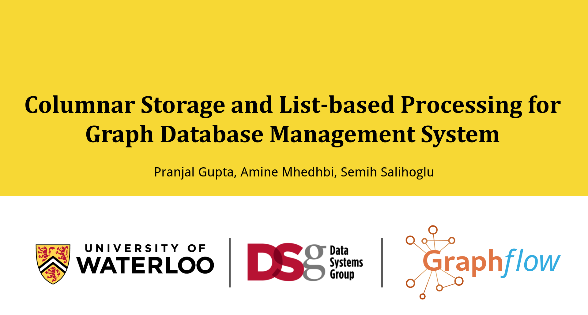

# Columnar Storage and List-based Processing in GraphflowDB

The official code repository of our VLDB 2021 paper ***Columnar Storage and List-based Processing for Graph
Database Management Systems***. 

- Research-track Paper @ VLDB 2021 [[link](https://https://www.vldb.org/pvldb/vol14/p2491-gupta.pdf)]
- arXiv (long-version) [[link](https://arxiv.org/abs/2103.02284)]

---

This repository contains the dataset, queries and the versions of the Graphflow system that we use in our paper. 

## Contents

  * [Codebase](#graphlfow-versions)
  * [Datasets](#datasets)
  * [Benchmarks](#benchmarks)
  * [Other Paper-related artifacts](#A)
  * [Contact](#contact)
  * [License](#license)

## Codebase

This repository contains 2 versions of GraphflowDB.

1. **GF-RV** [[link](https://github.com/graphflow/graphflow-columnar-techniques/tree/master/GF-RV)]: The baseline version that implements vanilla row-based storage and a volcano-based processor.
2. **GF-CL** [[link](https://github.com/graphflow/graphflow-columnar-techniques/tree/master/GF-CL)]: Version of GraphflowDB that implements our novel column-oriented storage and the List-based Processor.

> Both projects follow common instructions for building and benchmarking that can be found [here](https://github.com/graphflow/graphflow-columnar-techniques/blob/master/install.md).

## Datasets

We provide 2 datasets that we use for system comparison in the paper.

1. IMDb 2013 dataset [[link](https://drive.google.com/drive/folders/1JI6zLst8zz7dlg0KgbNsjiPxa_yWdRaO?usp=sharing)]
2. LDBC SNB dataset (scale factor 10) [[link]()]

> Users can use their own datasets to test their own benchmark queries. Instructions for creating own dataset can be found [here](https://github.com/graphflow/graphflow-columnar-techniques/blob/master/install.md#creating-own-dataset).

## Benchmarks

We test our system on 2 leading benchmarks: JOB and LDBC SNB. Since Graphflow do not support some advanced SQL features, we modify some queries as needed. We include the exact queries that we use here in the format that can directly be run on the builts.

1. JOB Benchmark Queries [[link](https://github.com/graphflow/graphflow-columnar-techniques/tree/master/queries/job-benchmark)]
2. LDBC SNB Interactive Complex Queries [[link]()]
3. LDBC SNB Interactive Short Queries [[link]()]

## Artifacts

- Video Presentation [[link](https://www.youtube.com/watch?v=2xN27cvfuEw)]
- Slides [[link](https://docs.google.com/presentation/d/1CKrk6CD6JiQyMl-PQ_aJ_blGfvARL5kbKgKNj1HXMQo/edit?usp=sharing)]
- Poster [[link](https://drive.google.com/file/d/1c0wjGMgqGMdavt8_xvlf_bEmrtPvbvYF/view?usp=sharing)]

## Contact 
[Pranjal Gupta](https://https://www.linkedin.com/in/g31pranjal/)   
[Amine Mhedhbi](mailto:m.amine.mhedhbi@gmail.com)

## License

This project is licensed under the [MIT License](https://opensource.org/licenses/MIT) - see the [LICENSE](LICENSE) file for details.

---
[GraphflowDB Project](http://graphflow.io)

Created at [Data Systems Group](https://uwaterloo.ca/data-systems-group/), [University of Waterloo](https://uwaterloo.ca), Canada.
